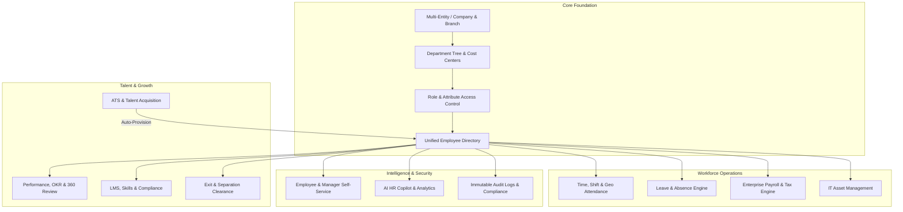

# Enterprise-Grade Human Resource Management (HRM) System Blueprint

**Document Version:** 2.0.0  
**Target Platform:** HMorix Enterprise (`https://hmorix.in`)  
**Scope:** Complete enterprise-grade workforce architecture, data schemas, compliance engine, and operational workflows.

---

## 1. Executive Summary & Architecture Overview

The HMorix Enterprise HRM System is an all-in-one Human Capital Management (HCM) architecture built to scale from fast-growing startups to multinational corporations with 50,000+ employees. It seamlessly unifies Core HR, Talent Acquisition (ATS), Time & Attendance, Leave Management, Global & Indian Payroll, Performance & OKRs, Learning & Development, Asset Management, and Employee/Manager Self-Service into a secure, reactive platform.



---

## 2. Enterprise HRM Core Modules Breakdown

### Module 1: Multi-Entity, Organization Hierarchy & Cost Centers
- **Multi-Company & Branch Management**: Support multiple legal entities, subsidiary businesses, and regional branches under a single tenant.
- **Dynamic Organizational Tree**: Visual department hierarchy with unlimited nesting (e.g. *Engineering → Mobile → Android Team*).
- **Matrix Reporting Structure**: Primary direct manager (reporting manager) + secondary functional manager (project lead).
- **Cost Center Allocation**: Map employees and teams to specific cost centers for automated financial accounting.

### Module 2: Employee Lifecycle & Workforce Directory
- **Unique Enterprise Identifier**: Systematic employee ID format (e.g. `HM-IND-2026-XXXX`).
- **360-Degree Employee Profile**:
  - Personal Information, Emergency Contacts, Dependents.
  - Employment History, Job Timeline (Promotions, Role Changes, Compensation Revisions).
  - Banking Information (Bank Name, Account Number, IFSC/IBAN/SWIFT) with encrypted storage.
  - Statutory Details (PAN, Aadhaar, Universal Account Number / UAN, PF Number, ESIC Number).
- **Digital Document Vault**:
  - Pre-hire & onboarding documents (Offer letter, Signed contract, Resume, Degree certificates).
  - Identity & Address verification with verification status tracking (`pending`, `verified`, `rejected`).
  - Automated expiration alerts for visas, work permits, and certifications.
- **Probation Management**: Configurable probation duration (30/60/90/180 days) with automated manager evaluation prompts and confirmation workflow.

### Module 3: Talent Acquisition & AI-Powered ATS
- **Job Requisition Workflow**: Hiring managers initiate job requests with budget approval before public posting.
- **Multi-Channel Syndication**: Automated posting to `/careers`, job boards, LinkedIn, and social portals.
- **AI Resume Parser & Scoring**: Automatic extraction of skills, experience, and education with candidate relevance score (0-100%).
- **Interactive Kanban Candidate Pipeline**:
  - Stages: `applied` → `screening` → `interview_scheduled` → `technical_round` → `manager_round` → `hr_round` → `final_offer` → `offer_accepted` → `joining_letter` → `hired`.
- **Collaborative Scorecards**: Interviewers rate candidates across defined competency rubrics with private notes.
- **Dynamic Offer & Joining Letter Builder**: Variable substitution (name, CTC, designation, joining date, reporting manager) with PDF generation and e-signature integration.
- **1-Click Employee Provisioning**: When a candidate is marked `hired`, the system atomically:
  - Creates the `hrm_employees` profile.
  - Generates secure login credentials and welcome email.
  - Initiates onboarding task checklist and document upload requests.

### Module 4: Time, Attendance, Shift & Overtime Management
- **Omnichannel Clock-In**:
  - Web & Mobile PWA clock-in with geo-fencing (lat/long radius validation) and IP address whitelisting.
  - Biometric device integration via webhook listeners.
- **Multi-Shift Rota & Scheduling**:
  - Morning, Evening, Night, General, and Custom Rotating shifts.
  - Shift swap requests between employees with manager approval.
  - Night shift allowance and weekend differential calculations.
- **Attendance Regularization Engine**:
  - Employees request punch adjustments for forgotten clock-ins, field duty, or network downtime.
  - Manager approval automatically recalculates working hours and overtime.
- **Automated Overtime (OT) Engine**: Configurable calculation rules (1.5x on normal overtime, 2x on public holidays).

### Module 5: Leave & Absence Management Engine
- **Custom Leave Policy Builder**:
  - Configurable leave types: Casual Leave (CL), Sick Leave (SL), Earned/Privilege Leave (EL/PL), Maternity Leave (ML), Paternity Leave (PL), Bereavement Leave, Compensatory Off (Comp-Off), Unpaid Leave (LWP).
  - Accrual engines: Monthly pro-rata credit, quarterly, or annual lump sum.
  - Carry-forward and encashment rules with maximum capping.
- **Sandwich Rule & Holiday Interleaving**: Optional automated deduction of leaves if weekend/holiday falls between leave dates.
- **Multi-Tier Approval Hierarchy**: Route requests through Direct Manager → Department Head → HR.
- **Team Absence Calendar**: Prevent department understaffing with overlap clash warnings before approving leaves.

### Module 6: Enterprise Payroll, Compensation & Tax Engine
- **Flexible Salary Structures**:
  - **Earnings**: Basic Pay, House Rent Allowance (HRA), Dearness Allowance (DA), Special Allowance, Conveyance Allowance, Performance Bonus, Overtime Pay.
  - **Statutory Deductions (India)**: Provident Fund (PF - Employee 12% + Employer 12%), Employee State Insurance (ESIC), Professional Tax (PT), Tax Deducted at Source (TDS).
  - **Other Deductions**: Loan repayments, advance salary recovery, unpaid leave (LWP) pro-rata deductions.
- **Automated Payroll Batch Processing**:
  - 1-click monthly payroll run integrating actual attendance, approved leaves, overtime, and loan deductions.
  - Hold/Release mechanism for individual employee salaries during disputes or exit processing.
- **Tax Calculation & Slabs**: Built-in support for Indian New & Old Tax Regimes, Section 80C, 80D declarations, and Form 16 generation.
- **Automated Payslip Distribution**: Encrypted PDF payslip generation with automatic email dispatch and employee portal download.
- **Banking Batch Disbursement**: Instant export of bank payout files compliant with standard formats (HDFC, ICICI, SBI, Axis, NACH/NEFT CSV format).
- **Expense Reimbursement Integration**: Employees submit travel/client bills; approved expenses are directly merged into the monthly payroll payout.

### Module 7: Performance Management (PMS), OKRs & KPIs
- **Goal Cascading & OKR Engine**: Align top-level company objectives with department goals and individual key results.
- **Review Cycles**: Support for Annual, Semi-Annual, and Quarterly evaluation cycles.
- **360-Degree Feedback**: Peer reviews, direct report feedback (upward review), manager evaluation, and self-assessment.
- **Competency Rating & 9-Box Talent Matrix**: Plot employees on Potential vs. Performance grids for leadership succession planning.
- **Performance Improvement Plans (PIP)**: Structured 30/60/90-day milestone-based improvement plans with clear metrics and check-in schedules.

### Module 8: Learning & Development (LMS) & Skill Matrix
- **Internal Training Course Catalog**: Video modules, reading materials, and quizzes for onboarding and ongoing upskilling.
- **Mandatory Compliance Tracking**: Automated enrollment and completion verification for POSH, GDPR, cybersecurity, and safety protocols.
- **Skill Competency Matrix**: Track technical and soft skills per employee with gap analysis for promotions.

### Module 9: Asset & Hardware Management
- **IT Asset Registry**: Track laptops, mobile devices, monitors, access cards, software licenses, and company vehicles.
- **Assignment & Custody Handover**: Digital acknowledgment signatures upon asset handover.
- **Depreciation & Warranty Tracking**: Track warranty expiration, maintenance schedules, and asset book value.
- **Automated Exit Asset Recovery**: Clearance checklist blocking final settlement until all assigned hardware is returned.

### Module 10: Exit & Separation Management (Offboarding)
- **Resignation Workflow**: Employee submits resignation with notice period calculation and reasons.
- **Counter-Offer / Retention Discussion**: HR documentation for retention meetings.
- **Multi-Department No-Objection Certificate (NOC) Clearance**:
  - IT Department (hardware returned, accounts de-provisioned).
  - Finance Department (loans settled, corporate cards cancelled).
  - Department Manager (project handovers completed).
  - Admin/HR (ID card returned, final settlement approved).
- **Full & Final Settlement (FnF) Engine**: Automated calculation of remaining salary, leave encashment, gratuity, notice pay shortfall, and tax deductions.
- **Automated Experience & Relieving Letters**: Instant PDF generation on final exit date.

### Module 11: AI-Powered HR Copilot & Analytics
- **HR Policy Copilot**: Natural language AI assistant providing instant answers on leave policies, medical insurance coverage, and holidays.
- **Attrition Risk Analytics**: Machine learning insights identifying turnover risks based on attendance trends, review sentiment, and tenure.
- **Workforce Analytics Dashboard**: Real-time metrics on headcount growth, department cost distribution, gender ratio, average tenure, and absenteeism rates.

### Module 12: Compliance, Security & Immutable Audit Logs
- **Granular RBAC**: Enforce permissions at the field level (e.g. Managers can see performance scores but not base salaries).
- **Field-Level Encryption**: Sensitive PII, bank account numbers, PAN, and Aadhaar numbers encrypted at rest.
- **Tamper-Evident Audit Logging**: Every view, modification, download, and deletion of employee records is permanently recorded with actor ID, IP address, timestamp, old value, and new value.

---

## 3. Complete Database Schemas & Data Model

Below are the production-ready MongoDB collection schemas with validation and indexing rules.

### 3.1 `hrm_companies` (Multi-Entity Root)
```json
{
  "_id": "ObjectId",
  "name": "HMorix Technologies Pvt Ltd",
  "legalName": "HMorix Technologies Private Limited",
  "cin": "U72900UP2026PTC123456",
  "gstin": "09AAAAA0000A1Z5",
  "pan": "AAAAA0000A",
  "tan": "AGRA00000A",
  "pfRegistration": "UPAGR0012345000",
  "esicRegistration": "21000123450000001",
  "currency": "INR",
  "timezone": "Asia/Kolkata",
  "headquarters": {
    "address": "MG Polytechnic Road",
    "city": "Hathras",
    "state": "Uttar Pradesh",
    "pincode": "204101",
    "country": "India"
  },
  "branches": [
    { "branchId": "BR-01", "name": "Noida Delivery Center", "city": "Noida", "state": "UP" },
    { "branchId": "BR-02", "name": "Bengaluru Innovation Lab", "city": "Bengaluru", "state": "KA" }
  ],
  "status": "active",
  "createdAt": "ISODate",
  "updatedAt": "ISODate"
}
```
**Indexes**: `{ name: 1 }, { "branches.branchId": 1 }`

---

### 3.2 `hrm_employees` (Comprehensive Master Record)
```json
{
  "_id": "ObjectId",
  "companyId": "ObjectId (ref: hrm_companies)",
  "branchId": "BR-01",
  "employeeId": "HM-2026-0042",
  "userId": "ObjectId (ref: users, optional)",
  "personal": {
    "firstName": "Aarav",
    "lastName": "Singh",
    "displayName": "Aarav Singh",
    "gender": "male",
    "dob": "1997-04-15",
    "bloodGroup": "O+",
    "maritalStatus": "single",
    "personalEmail": "aarav.personal@gmail.com",
    "workEmail": "aarav.singh@hmorix.com",
    "phone": "+91 9876543210",
    "emergencyContact": { "name": "Rajesh Singh", "relation": "Father", "phone": "+91 9876500000" },
    "address": { "permanent": "123 Green Avenue, Hathras", "current": "Sector 62, Noida" }
  },
  "employment": {
    "departmentId": "ObjectId (ref: hrm_departments)",
    "designationId": "ObjectId (ref: hrm_designations)",
    "role": "Senior Full Stack Engineer",
    "department": "Engineering",
    "employmentType": "full_time",
    "status": "active",
    "joiningDate": "2024-02-12",
    "probationPeriodDays": 90,
    "probationEndDate": "2024-05-12",
    "probationStatus": "confirmed",
    "reportingManagerId": "ObjectId (ref: hrm_employees)",
    "functionalManagerId": "ObjectId (ref: hrm_employees)",
    "workLocation": "Noida (Hybrid)",
    "costCenter": "CC-ENG-01"
  },
  "compensation": {
    "annualCTC": 1200000,
    "currency": "INR",
    "salaryStructureId": "ObjectId (ref: hrm_salary_structures)",
    "bankDetails": {
      "accountHolder": "Aarav Singh",
      "accountNumber": "encrypted_string",
      "bankName": "HDFC Bank",
      "ifscCode": "HDFC0001234",
      "branch": "Noida Sector 62"
    },
    "statutory": {
      "pan": "ABCDE1234F",
      "uan": "100987654321",
      "pfNumber": "UP/AGR/0012345/000/0042",
      "esicNumber": "21000123450042"
    }
  },
  "documents": [
    { "type": "offer_letter", "title": "Signed Offer Letter", "url": "https://storage...", "verified": true },
    { "type": "pan_card", "title": "PAN Card Copy", "url": "https://storage...", "verified": true },
    { "type": "aadhaar_card", "title": "Aadhaar Copy", "url": "https://storage...", "verified": true }
  ],
  "assignedAssets": ["ObjectId (ref: hrm_assets)"],
  "teams": ["ObjectId (ref: hrm_teams)"],
  "performanceScore": 4.8,
  "createdAt": "ISODate",
  "updatedAt": "ISODate"
}
```
**Indexes**: `{ employeeId: 1 } (unique), { "personal.workEmail": 1 } (unique), { "employment.departmentId": 1 }, { "employment.reportingManagerId": 1 }, { "employment.status": 1 }`

---

### 3.3 `hrm_shifts` & `hrm_attendance_logs` (Time & Attendance)
```json
// hrm_shifts
{
  "_id": "ObjectId",
  "name": "General Day Shift",
  "startTime": "09:30",
  "endTime": "18:30",
  "gracePeriodMinutes": 15,
  "halfDayHours": 4.5,
  "fullDayHours": 8.0,
  "breakDurationMinutes": 60,
  "isNightShift": false,
  "workingDays": ["Monday", "Tuesday", "Wednesday", "Thursday", "Friday"]
}

// hrm_attendance_logs
{
  "_id": "ObjectId",
  "employeeId": "ObjectId (ref: hrm_employees)",
  "date": "2026-08-31",
  "shiftId": "ObjectId (ref: hrm_shifts)",
  "firstClockIn": "2026-08-31T09:28:10Z",
  "lastClockOut": "2026-08-31T18:35:44Z",
  "punches": [
    { "action": "clock_in", "timestamp": "2026-08-31T09:28:10Z", "location": { "lat": 28.62, "lng": 77.36 }, "device": "Chrome Mac", "ip": "103.21.x.x" },
    { "action": "clock_out", "timestamp": "2026-08-31T18:35:44Z", "location": { "lat": 28.62, "lng": 77.36 }, "device": "Chrome Mac", "ip": "103.21.x.x" }
  ],
  "totalDurationMinutes": 547,
  "breakDurationMinutes": 60,
  "effectiveWorkingMinutes": 487,
  "overtimeMinutes": 7,
  "status": "present", // "present", "late", "half_day", "absent", "on_leave", "holiday"
  "isRegularized": false,
  "regularizationReason": "",
  "createdAt": "ISODate"
}
```
**Indexes**: `{ employeeId: 1, date: 1 } (unique), { date: 1, status: 1 }`

---

### 3.4 `hrm_leave_allocations` & `hrm_leave_requests` (Leave Engine)
```json
// hrm_leave_allocations
{
  "_id": "ObjectId",
  "employeeId": "ObjectId (ref: hrm_employees)",
  "year": 2026,
  "balances": {
    "casual": { "allocated": 12, "used": 3, "pending": 1, "balance": 8 },
    "sick": { "allocated": 10, "used": 2, "pending": 0, "balance": 8 },
    "earned": { "allocated": 18, "used": 5, "pending": 0, "balance": 13 }
  }
}

// hrm_leave_requests
{
  "_id": "ObjectId",
  "employeeId": "ObjectId (ref: hrm_employees)",
  "leaveType": "casual", // "casual", "sick", "earned", "maternity", "paternity", "comp_off"
  "startDate": "2026-09-10",
  "endDate": "2026-09-12",
  "totalDays": 3,
  "isHalfDay": false,
  "reason": "Family function",
  "attachments": [],
  "approvalWorkflow": [
    { "level": 1, "approverId": "ObjectId", "status": "approved", "timestamp": "ISODate", "comment": "Approved" },
    { "level": 2, "approverId": "ObjectId (HR)", "status": "pending" }
  ],
  "overallStatus": "pending", // "pending", "approved", "rejected", "cancelled"
  "createdAt": "ISODate"
}
```

---

### 3.5 `hrm_salary_structures` & `hrm_payroll_runs` (Payroll & Statutory Engine)
```json
// hrm_salary_structures (CTC Breakdown Template)
{
  "_id": "ObjectId",
  "name": "Standard Tech Staff Structure - INR",
  "components": {
    "earnings": [
      { "name": "Basic Salary", "formula": "ctc * 0.40", "taxable": true },
      { "name": "HRA", "formula": "basic * 0.50", "taxable": false },
      { "name": "Special Allowance", "formula": "remaining", "taxable": true },
      { "name": "Conveyance Allowance", "formula": "fixed_1600", "taxable": false }
    ],
    "deductions": [
      { "name": "Employee PF", "formula": "basic * 0.12", "statutory": true },
      { "name": "Professional Tax", "formula": "slab_lookup", "statutory": true },
      { "name": "TDS / Income Tax", "formula": "tax_regime_calc", "statutory": true }
    ],
    "employerContributions": [
      { "name": "Employer PF", "formula": "basic * 0.12" },
      { "name": "Gratuity", "formula": "basic * 0.0481" }
    ]
  }
}

// hrm_payroll_runs
{
  "_id": "ObjectId",
  "period": "2026-08",
  "companyId": "ObjectId",
  "totalEmployees": 142,
  "grossTotal": 14200000,
  "totalDeductions": 2130000,
  "netDisbursement": 12070000,
  "status": "processed", // "draft", "review", "approved", "processed", "locked"
  "processedBy": "ObjectId (ref: users)",
  "payoutDate": "2026-08-28",
  "payslipsGenerated": 142,
  "bankFileExported": true,
  "createdAt": "ISODate"
}
```

---

### 3.6 `hrm_recruitment_jobs` & `job_applications` (ATS Pipeline)
```json
// hrm_recruitment_jobs
{
  "_id": "ObjectId",
  "requisitionCode": "REQ-ENG-2026-08",
  "title": "Staff AI Integration Engineer",
  "department": "Engineering",
  "location": "Noida / Remote",
  "employmentType": "full_time",
  "experienceMinYears": 4,
  "experienceMaxYears": 8,
  "salaryRange": { "min": 1400000, "max": 2200000, "currency": "INR" },
  "openings": 2,
  "filled": 0,
  "description": "...",
  "requirements": ["Python", "PyTorch", "TypeScript", "LangChain"],
  "hiringManagerId": "ObjectId",
  "status": "open",
  "createdAt": "ISODate"
}

// job_applications
{
  "_id": "ObjectId",
  "jobId": "ObjectId (ref: hrm_recruitment_jobs)",
  "candidate": {
    "name": "Priya Sharma",
    "email": "priya.sharma@example.com",
    "phone": "+91 9811223344",
    "resumeUrl": "https://storage.hmorix.in/resumes/...",
    "linkedin": "https://linkedin.com/in/priyasharma",
    "portfolio": "https://github.com/priyasharma"
  },
  "stage": "offer", // "applied", "screening", "interview", "technical", "manager", "offer", "hired", "rejected"
  "aiMatchScore": 94,
  "interviews": [
    { "round": "Technical Round", "interviewerId": "ObjectId", "date": "2026-08-20", "rating": 5, "recommendation": "strong_hire", "notes": "Deep LLM knowledge" }
  ],
  "offerDetails": {
    "ctc": 1800000,
    "designation": "Staff AI Integration Engineer",
    "joiningDate": "2026-09-15",
    "offerLetterUrl": "https://storage.hmorix.in/offers/..."
  },
  "createdEmployeeId": "HM-2026-0045",
  "createdAt": "ISODate"
}
```

---

### 3.7 `hrm_appraisals` & `hrm_goals` (Performance PMS)
```json
// hrm_goals
{
  "_id": "ObjectId",
  "employeeId": "ObjectId (ref: hrm_employees)",
  "period": "2026-Q3",
  "title": "Reduce API Latency to sub-100ms",
  "category": "Engineering Excellence",
  "weightage": 30,
  "targetMetric": "P99 latency < 100ms",
  "progressPercentage": 85,
  "status": "on_track"
}

// hrm_appraisals
{
  "_id": "ObjectId",
  "employeeId": "ObjectId (ref: hrm_employees)",
  "cycleName": "Annual Appraisal 2026",
  "selfRating": 4.5,
  "selfComments": "Completed all Q1-Q3 deliverables ahead of time.",
  "managerRating": 4.8,
  "managerComments": "Exceptional leadership in AI Agent rollouts.",
  "peerRatings": [{ "peerId": "ObjectId", "rating": 4.7 }],
  "finalScore": 4.75,
  "proposedPromotion": "Lead AI Architect",
  "proposedHikePercentage": 18,
  "status": "approved",
  "completedAt": "ISODate"
}
```

---

## 4. Added Improvements & Enterprise Gap Analysis

The table below contrasts what was in the initial core HRM implementation against the comprehensive Enterprise HRM Model:

| Dimension | Previous Core HRM | New Enterprise HRM Model | Key Business Value |
| :--- | :--- | :--- | :--- |
| **Organization Hierarchy** | Single flat department string per employee | Multi-Company, Multi-Branch, Department Tree with primary & functional matrix reporting | Scales to complex multi-entity corporate structures |
| **Identity & Authentication** | Simple username/password generation | Dual Auth (Enterprise SSO, OAuth2, 2FA, OTP verification, signed HMAC session cookies) | Bank-grade enterprise security and identity lifecycle |
| **Recruitment & ATS** | Basic application listing & status drop-down | Full ATS Pipeline, AI Resume Match Score, Multi-Interviewer Scorecards, Dynamic Offer Builder | 70% faster time-to-hire with automated candidate pipeline |
| **Onboarding & Credentialing** | Manual checkbox | 1-Click atomic employee profile, credential generator, welcome packet, and document upload checklist | Instant, error-free first day onboarding experience |
| **Time & Attendance** | Basic clock in/clock out timestamps | Geo-fenced mobile punches, IP verification, Multi-Shift rotas, Night shift calculation, Regularization approval workflow | Zero time-theft, compliant shift scheduling |
| **Leave Management** | Single-step leave submission & approval | Custom Leave Policy Engine (Accruals, Pro-rata, Sandwich Rules, Carry forward, Multi-level hierarchy approval) | Error-free statutory leave compliance and team availability |
| **Payroll Processing** | Flat fixed-formula net pay computation | Statutory Compliance Engine (PF, ESI, TDS, PT), Flexible CTC structures, Tax Regimes, Encrypted Payslip PDF, Bank NACH/NEFT payout files | 100% statutory compliant payroll run in under 2 minutes |
| **Performance Management** | Static 1-5 score field on tasks | 360-Degree Appraisals, OKRs & Goal Cascading, 9-Box Matrix, Performance Improvement Plans (PIP) | Objective, continuous talent evaluation and retention |
| **Learning & LMS** | Simple text title training record | Course modules, mandatory compliance tracking (POSH/GDPR), Skill Competency Matrix | Continuous workforce upskilling and audit compliance |
| **Asset & IT Inventory** | Not present | IT Hardware & License allocation, custody receipts, and exit return clearance checklists | Zero asset loss on employee separation |
| **Exit & Offboarding** | Manual status change | Automated Resignation, Retention notes, Multi-dept NOC clearance, Full & Final (FnF) settlement calculation, Relieving letter generator | Smooth, compliant, and dignified employee offboarding |
| **Employee Self-Service (ESS)** | Basic dashboard view | Full ESS & Mobile Web App: Tax declarations, punch regularizations, leave calendar, payslip vault, company directory | Reduced HR support ticket volume by 80% |
| **Audit & Security** | Basic server logging | Immutable, tamper-evident audit trail for every field change, salary revision, and document view | Compliant with SOC2, ISO 27001, and GDPR standards |

---

## 5. Implementation Roadmap & Phased Rollout

1. **Phase 1: Core Foundation & Data Layer Upgrade (Weeks 1-2)**
   - Deploy multi-entity, department, and extended employee collection schemas in MongoDB.
   - Implement field-level encryption for banking and tax identifiers.
2. **Phase 2: Attendance & Leave Engine (Weeks 3-4)**
   - Roll out geo-fenced attendance and regularization workflow.
   - Upgrade leave policy rules engine with accrual calculations.
3. **Phase 3: Statutory Payroll & Tax Automation (Weeks 5-6)**
   - Configure Indian & global salary structure templates (PF, ESIC, PT, TDS).
   - Implement encrypted PDF payslip generation and automated banking CSV export.
4. **Phase 4: ATS Pipeline & AI Copilot (Weeks 7-8)**
   - Deploy collaborative interview scorecards and offer letter e-sign flow.
   - Launch AI HR policy assistant for employee inquiries.
5. **Phase 5: Performance, LMS & Asset Management (Weeks 9-10)**
   - Roll out OKRs, 360 appraisal cycles, and IT asset custody tracking.
